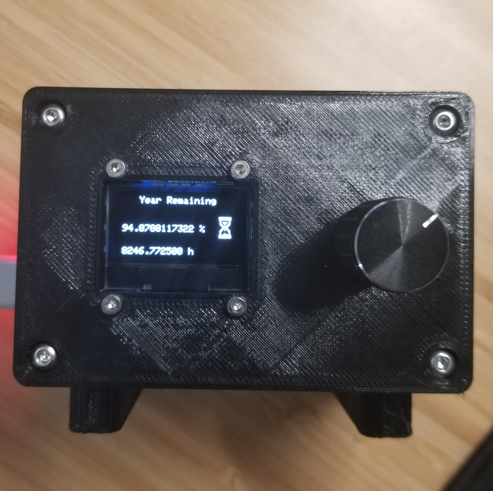
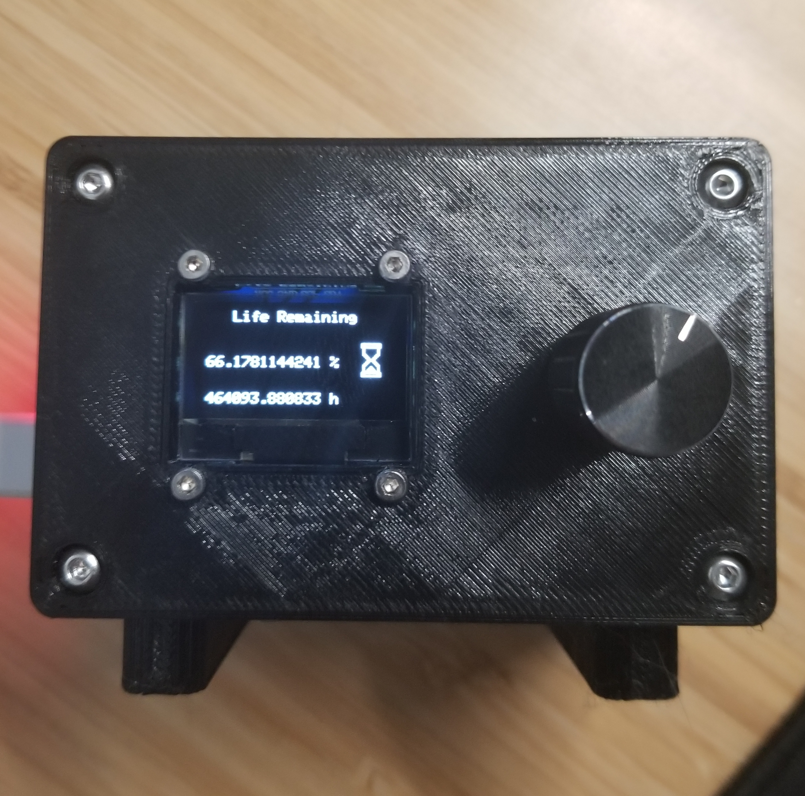
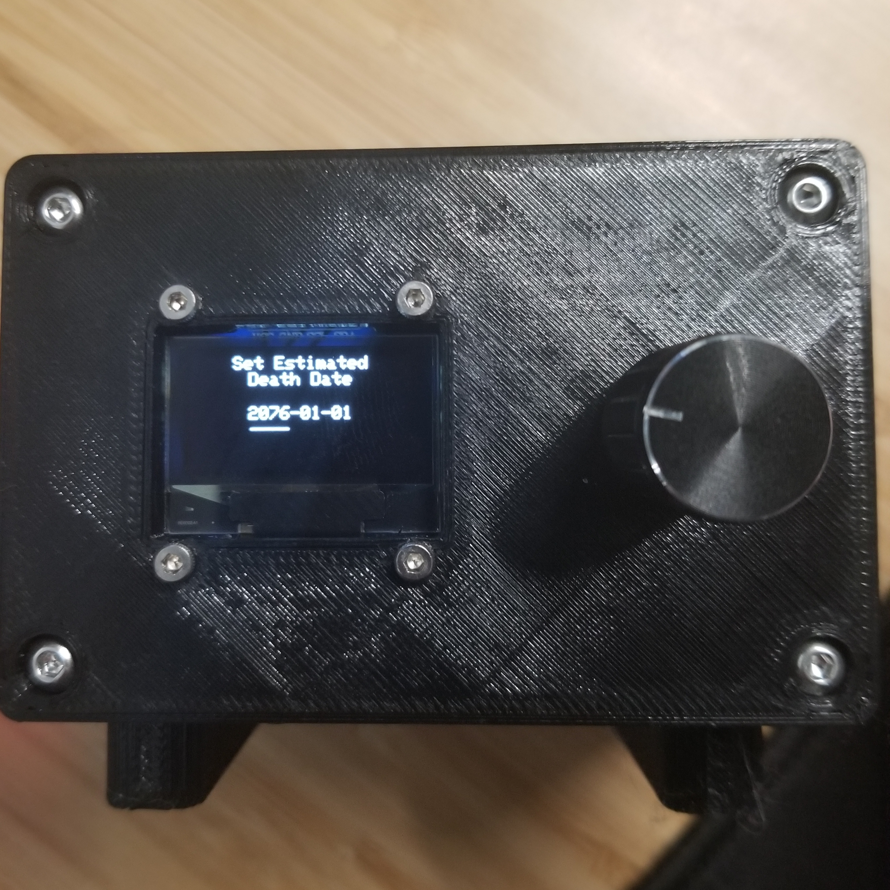
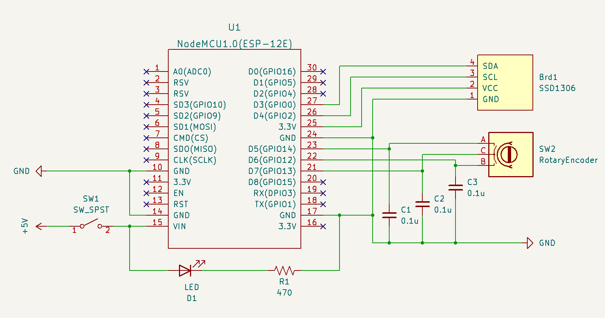
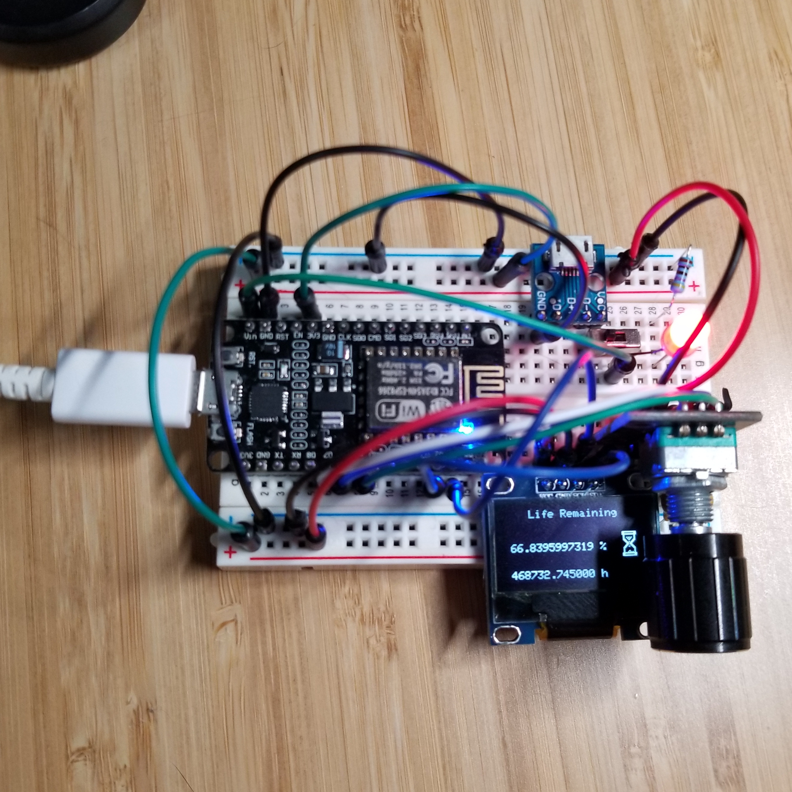

# memento-mori

A reminder to stop wasting time.

*memento mori* - Latin for "remember that you [have to] die".

## Summary

- Clock synced via NTP (syncs every 30 minutes)
- Year remaining calculator
- Life remaining calculator
- Configurable UTC offset, birth date, and estimated death date
- Configured values are saved to file system on each edit
- Screen navigation with rotary encoder
  - Date/Time (NTP synced)
  - Year remaining
  - Life remaining
  - UTC offset (click to edit)
  - Birth date (click to edit)
  - Estimated death date (click to edit)
  - Force NTP refresh (click to refresh)

## Images

## Circuit

Note: I forgot to take a picture of the protoboard circuit I soldered.

## Parts List

- 1 x ESP8266
- 1 x SSD1306 0.96 inch 128x64 OLED
- 1 x KY-040 Rotary Encoder
- 3 x 0.1µF Ceramic Capacitor
- 1 x Red LED
- 1 x 470Ω Resistor
- 1 x SPST Switch
- 1 x Micro USB Interface Power Adapter Board
- 4 x M3x10mm screw
- 4 x M2x10mm screw
- 4 x M2 nut
- 4 x M2.5x6+6mm brass standoff
- 4 x M2.5x8mm screw

## References

- https://en.wikipedia.org/wiki/Memento_mori
- [Windows 98 loading gif](https://media.tenor.com/5JWmM_Hd3rIAAAAC/loading-windows98.gif)
- https://ezgif.com/
