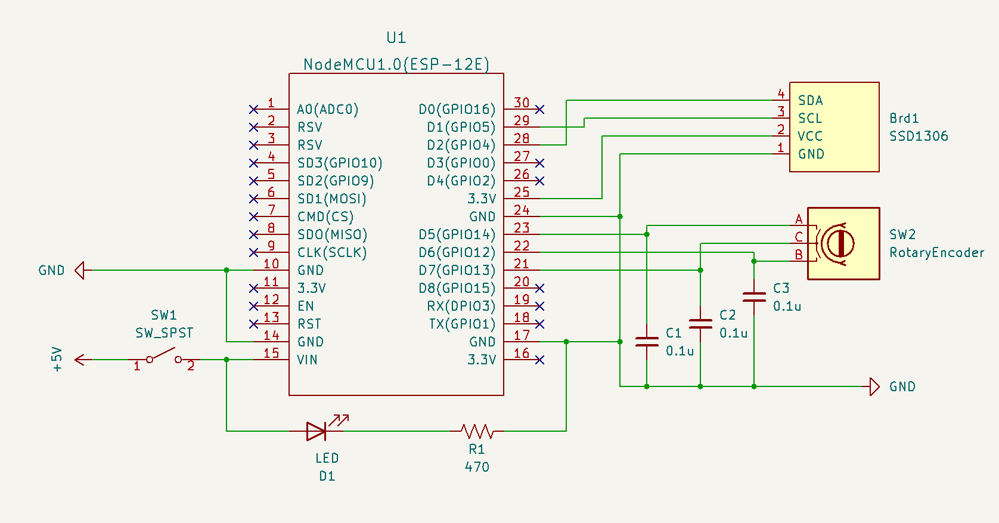

# memento-mori

A reminder to stop wasting time.

*memento mori* - Latin for "remember that you [have to] die".

## Summary

- Clock synced via NTP
- Year progress calculator
- Life progress calculator
- Configurable UTC offset, birth date, and estimated death date
- Configured values are saved to file system on each edit

## Circuit

### Parts List

- 1 x ESP8266
- 1 x SSD1306 0.96 inch 128x64 OLED
- 1 x KY-040 Rotary Encoder
- 3 x 0.1µF Ceramic Capacitor
- 1 x Red LED
- 1 x 470Ω Resistor
- 1 x Switch
- 1 x Micro USB Interface Power Adapter Board

## References

- [Windows 98 loading gif](https://media.tenor.com/5JWmM_Hd3rIAAAAC/loading-windows98.gif)
- https://ezgif.com/
